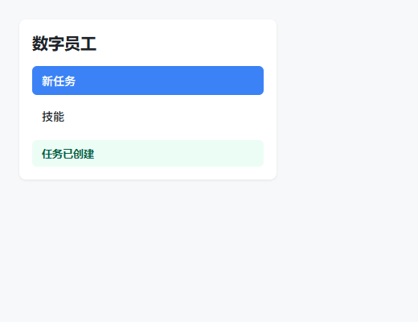
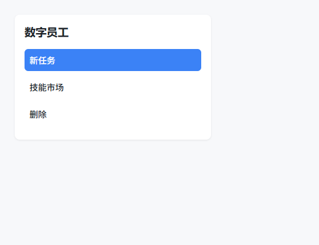
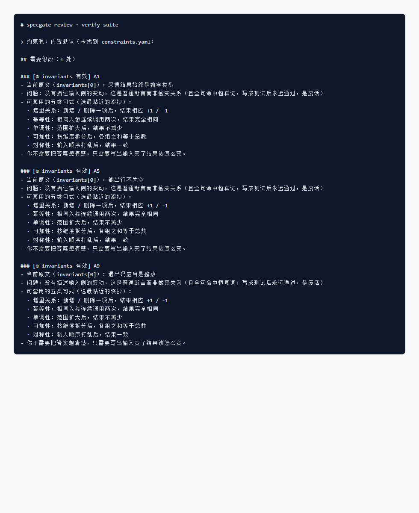

# verify-suite


> **判定层**为主,CDP 只是**当前唯一的采集适配器**。
> 给前端页面对设计稿 demo 做**视觉还原** + 对 PRD 做**交互还原**,输出**可判定**的差异报告。

## 为什么需要独立判定

执行正在被自动化吃掉 —— 起浏览器、点按钮、抓数据,这些会越来越便宜、越来越商品化。
执行越自动,**独立判定就越成为瓶颈**:谁能说清"这两个页面算不算还原一致",谁才握有验收权。
判定权必须外置:判据不能长在执行脚本里,否则换一次驱动就得把判据重写一遍。

所以本仓库分两层:**判定层(资产)** —— 容差规则、对齐判据、断言语义,纯函数,可脱离浏览器运行;
**驱动层(适配器)** —— 当前用 CDP 采集,可以换。判定层不依赖驱动层,由 `npm run check:layering` 强制守住。

## TL;DR · 30 秒建立心智

- **它做什么**:把"页面 1 vs 页面 2"或"页面 vs 设计稿"变成一份**退出码为 0/2**的差异清单 —— 谁偏大、谁偏小、哪侧独有。
- **它不是什么**:不是截图对比工具(不取整张图片的 SSIM / pHash),不是 E2E(不写业务流),不是单测框架。
- **一条命令链**:采集一次 → 采集二次 → 比对 → 看输出。所有脚本共用同一份语义指纹,可比;同一份退出码约定,可接 CI。

## 能做什么 vs 不做什么

| ✅ 能 | ❌ 不 |
|---|---|
| 在 DOM 上采集**运行时**几何/字号/字重/色值 | 读源码声明值(不信 Tailwind class 名,要看到计算后的 px) |
| 对齐**异构 DOM**(语义指纹 = `role\|文案`) | 比整张图(视觉风格抖动它认,像素抖动它不认) |
| 指出**谁偏大、谁偏小**,容差按量纲分档 | 自动改实现(给的是诊断,不是补丁) |
| 同一份轨迹在两侧各跑一次,各自对照断言 | 代替人写断言(语义断言还是人来写) |
| 零 npm 依赖,Node 22 + 任意 Chromium 浏览器 | 服务端 headless 渲染(要真实浏览器) |

## 30 秒最小 demo

开一个独立 profile 的调试浏览器(不碰你正在用的浏览器),跑三条路线,截两张图:

```bash
# 起一个 headless Edge,端口 9222,独立 user-data-dir
"C:/Program Files (x86)/Microsoft/Edge/Application/msedge.exe" \
  --remote-debugging-port=9222 \
  --user-data-dir=C:/Users/super/AppData/Local/Temp/vs-profile \
  --headless=new about:blank &

# 一键跑 demo(已注入 4 处真实差异)
bash examples/demo/run-demo.sh
```

demo 故意注入的差异:`fontSize 20→18` / `padding 12→8` / 「技能」→「技能市场」/ 产线多一个「删除」/ 产线漏实现点击反馈。

### 视觉还原 · 路线 B 语义指纹

> 路线 B 拿 Accessibility.getFullAXTree 给整页每个交互元素建语义指纹(`role\|文案`),按 8px 网格量化排序、指纹归一化(数字 → `#`、空白剥离、40 字截断)后做四档对齐:精确 / 模糊(文案漂移) / 仅基准 / 仅实测。


*同一份交互,设计稿(左)出状态条,产线(右)没反应 —— 视觉差异一目了然。*

```text
— 仅实测侧存在(实现多余,1) —
  ⚠ button|删除 "删除"  @40,168
— 度量差异(3 组) —
  ❌ [精确]  heading|数字员工
   ❌ fontSize  产线 18 ←→ 设计稿 20  (产线偏小 -2, strict)
  ❌ [精确]  button|新任务
   ❌ inLeft   产线 8  ←→ 设计稿 12  (产线偏小 -4)
  ⚠ [模糊 0.50]  button|技能      ← 「技能」→「技能市场」文案漂移
汇总: 差异项 3 · 仅实测 1  → 退出码 2
```

### 视觉还原 · 路线 A 探针精确卡尺

> 路线 A 是手动写的探针(知道要测哪个元素,精确到字段)。`strict` 字段零容差(字号/字重/圆角是离散设计 token,差 1 就是选错档,不是抖动),其它默认 ±1px。

```text
❌ 页面标题
  ❌ fontSize  产线 18 ←→ 设计稿 20  (产线偏小 -2, strict(零容差))
  ✅ fontWeight  产线 "600" ←→ 设计稿 "600"
❌ 主按钮·新任务
  ❌ inLeft    产线 8 ←→ 设计稿 12  (产线偏小 -4, 容差±1)
  ✅ fontSize  产线 14 ←→ 设计稿 14
  ✅ borderRadius  产线 "6px" ←→ 设计稿 "6px"
✅ 次按钮·技能   fontSize/borderRadius 一致,inLeft 与设计稿相同
汇总: 通过 0 · 差异 3  → 退出码 2
```

### 交互还原 · 轨迹两侧各自对照同一份语义断言

> 关键设计:**两侧各自对照同一份断言**,不比较"变化量是否相同"。两侧 DOM 量不同时,"比变化量"会产生 82 项噪声。
>
 三种判定:✓ 双达成 / ✗ 仅一侧不达成(真 bug,改代码)/ ⚠️ 双不达成(断言写错了,改断言)。


*产线点击「新任务」按钮后,缺少绿色状态条 —— trace-diff 输出 ✗ 真差异。*

```text
步骤 [0] 点击「新任务」按钮
  ❌ appeared heading|任务已创建   仅 产线 未达成  ← 真差异,改代码
汇总:
  ✓ 两侧都达成      0
  ✗ 仅一侧不达成    1   → 真差异,改代码
  ⚠ 两侧都不达成    0
退出码 2
```

### 行为还原 · 路线 E 行为契约(视觉一模一样也可能行为不同)

前四条路线回答"看起来对不对",路线 E 回答"**做对了没有**" —— 按钮点了但没发请求、
埋点少一条、响应少个字段,这些视觉比对**一条都抓不到**。

观测四类事实:网络请求(方法/URL/body 字段)、console 埋点、响应结构(字段**存在性与类型**)、产物文件。
★ 只断言结构,不断言业务数值(id 等于几、金额多少是业务测试的事,不是还原度的事)。

```text
步骤 0: 点击「新任务」
  ✓ console /task_create/
  ✗ console /task_created id=/   仅 产线 未达成   ← 真差异,改代码
汇总: 共 2 条断言 · 证据档位: console · 可信度 high
退出码 2
```
*设计稿点了发 2 条埋点,产线只发 1 条 —— 页面上完全看不出来,但契约确实没实现。*

## 路线选择

```
跑 probe-anchors 体检  →  看角色密度 + testid 密度 + div 模拟占比
 ├─ 角色/testid 较全(>40%)  → 走路线 B(ax-collect + ax-diff)
 ├─ 角色缺失,div 模拟为主    → 走路线 C(unit-collect)
 └─ 目标组件明确,需要精确字段 → 走路线 A(geo-collect + 手写 probes.json)

视觉都对上了,还要确认行为对不对 → 加跑路线 E(behavior-collect + behavior-diff)
```

> DOM 决策一旦动了,指纹照样能跟上;用 selector 一动就废,这是 fingerprint vs selector 的成本差。

## 命令索引

| 脚本 | 职责 |
|---|---|
| `cdp-client.mjs` | 基础调试 CLI:新建受控标签页、注入日志拦截器、snapshot/click/type/drag/assert/screenshot/evaluate/watch 等 |
| `geo-collect.mjs` / `geo-compare.mjs` | 路线 A:人工探针精确卡尺 |
| `ax-collect.mjs` / `ax-diff.mjs` | 路线 B:语义指纹全量扫描 + 通用比对器(本项目核心) |
| `unit-collect.mjs` | 路线 C:交互单元 + 文本骨架(角色缺失时的主路线) |
| `probe-anchors.mjs` / `probe-layer.mjs` | 诊断:选路线 / 弹层定位与归属 |
| `trace-run.mjs` / `trace-diff.mjs` | 交互还原:轨迹双跑 + 两侧各对照同一份语义断言 |
| `behavior-collect.mjs` / `behavior-diff.mjs` | 路线 E:行为契约(埋点 / 请求 / 响应结构 / 产物) |
| `check-layering.mjs` | 分层守卫:判定层不得依赖驱动层(`npm run check:layering`) |

详细参数与坑位清单见 [`SKILL.md`](./SKILL.md),七条核心原则与各路线权衡见原始任务文档。

## 证据等级:每条结论都标注"它是靠什么知道的"

没有证据等级的结论是危险的 —— 用像素比对得出的"有差异",和用计算样式得出的"左边距差 4px",
看起来都是"检出差异",**可行动性差着一个量级**。所以每个 item 都带 `evidence` 与 `confidence`。

| 档位 | 来源 | 能做什么 |
|---|---|---|
| `computed-style` | 运行时计算样式 + 精确几何 | 能归因、能定位到 1px(路线 A) |
| `ax-tree` | 无障碍树语义身份 | 能归因,但拿不到精确几何(路线 B / 轨迹) |
| `text-skeleton` | 文案 + 网格位置推断 | 能对齐,但没有语义身份(路线 C) |
| `network` / `console` | 行为事实 | 证明"做了什么",不证明"长什么样"(路线 E) |
| `pixel` | 像素 | 只知道有差异,**无法归因** |
| `none` | 没证据 | 不配叫结论 |

**一次比对的可信度 = 所有 item 里最低的那一档**(木桶效应),汇总行会打印出来:

```text
证据档位: ax-tree · 可信度 high
证据档位: computed-style · 可信度 high
证据档位: console · 可信度 high
```

**降级必须留痕,严禁静默降级**。当预期走无障碍树但角色不足、实际落到文本骨架时,
报告里会写 `degradation` 字段说明原因;没降级就是显式 `null` —— 让你知道"确认过,没降级"。

## 退出码(CI 可消费)

| 码 | 含义 |
|---|---|
| `0` | 无差异 / 全部断言达成 |
| `1` | 执行错误(目标未找到、页面加载失败、参数错误、**采集为空**、检测到无进展) |
| `2` | 检出差异 / 断言未达成 |

> ★ **空结果不是无差异,是执行错误**。采集到 0 个节点或低于 `--min-items`(默认 3)一律退出 1。
> 失效链:preload 静默失效 → 采到空快照 → 两侧都空 → 判"无差异"退出 0 → **误报通过**。
> 宁可吵,不可假绿。

## 与 specgate 联动

验收标准以机器可消费的契约形式落在 [`acceptance/contract.yaml`](./acceptance/contract.yaml),
由 [specgate](https://github.com/supernisy/specgate) 做确定性门禁(零模型、可复现)。
契约里每条 `accept` 的 `verify` 字段直接对应本工具的某条路线:
`geo` → geo-compare · `ax` → ax-diff · `unit-visual` → unit-collect · `trace` → trace-diff。

> specgate 管「该验什么」,verify-suite 管「怎么验」。

### 实际跑一遍(可复现)

两个仓库独立。在 specgate 仓库下,直接对 verify-suite 的契约文件跑门禁即可:

```bash
cd /path/to/specgate
node src/cli.js lint /path/to/verify-suite/acceptance/contract-bad.yaml   # 退出码 2:拦截 3 处恒真废话
node src/cli.js lint /path/to/verify-suite/acceptance/contract.yaml       # 退出码 0:全部通过
```


*坏契约被拦:3 条 invariants(A1/A5/A9)被判恒真废话,逐一给出修改建议。通过态见 [specgate 的 PASS 截图](https://github.com/supernisy/specgate/blob/main/docs/specgate-pass-review.png)。*

> 这份契约就是 verify-suite 自己的验收门禁:落在 `acceptance/` 下,由 specgate `lint` 把门、`plan` 切出 `impl-task/` 与 `test-task/` 两个物理隔离任务包。

### PR 自动门禁（无需手动跑）

门禁已接进 CI:任何改动 `acceptance/` 下契约的 PR,都会先过 specgate `lint`,
契约不合格 → 检查失败 → PR 不允许合并。

- 工作流:[`.github/workflows/specgate-gate.yml`](./.github/workflows/specgate-gate.yml)
- 自动发现 `acceptance/*.yaml` 并逐一 `lint`,**跳过** `*-bad.yaml`(故意坏样本)与 `*.draft.yaml`(草稿)。
- 克隆 [supernisy/specgate](https://github.com/supernisy/specgate) 后 `npm install`(依赖 `yaml`),再 `node src/cli.js lint <契约>`。
- 本地想提前自检,命令与上方「实际跑一遍」完全一致。

## 文档导航

- [`SKILL.md`](./SKILL.md) · 每条命令的用法 + 场景选择 + 踩坑提示
- [`AGENTS.md`](./AGENTS.md) · 给后续 AI 的工程化决策与设计权衡
- [`acceptance/contract.yaml`](./acceptance/contract.yaml) · specgate 验收契约
- [`examples/demo/`](./examples/demo) · 可一键复现的最小 demo

## License

MIT